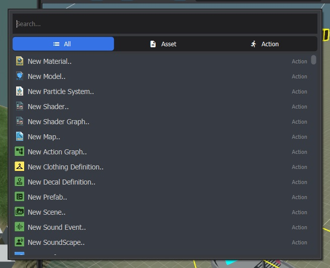

# Quick Switcher
A simple tool that adds quick switching and quick action functionality to your s&box project. Press **Ctrl+K** to activate the quick switcher window.

### Install
Copy the .cs files from this repository to the `code/Editor` folder in your s&box project. If you don't have an Editor folder, simply create one.